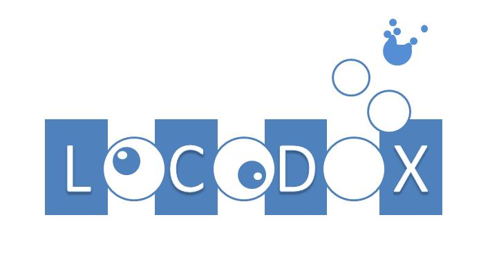

LOCODOX is a MATLAB based interactive software that corrects dissolved oxygen concentration data acquired by Argo profiling floats. The correction schemes are based on Takeshita et al (2013) and Bittig and Kortzinger (2018). Three types of correction are proposed : a pressure dependent correction, a time drift correction and a slope/ offset correction (also called Gain correction).

LOCODOX works with Argo v3.1 netcdf files and provides files with corrected and well formatted delayed mode Argo data compliant with the Argo format (Argo Data Management Team, 2019).  LOCODOX corrects only oxygen data available in the vertical profiles. This document describes the methodology and the strategy followed by the tool, and it explains how to install and use LOCODOX.

## How to install ?

## Usage

## Dev. roadmap

## New features

The tool can now offer correction based on PPOX
